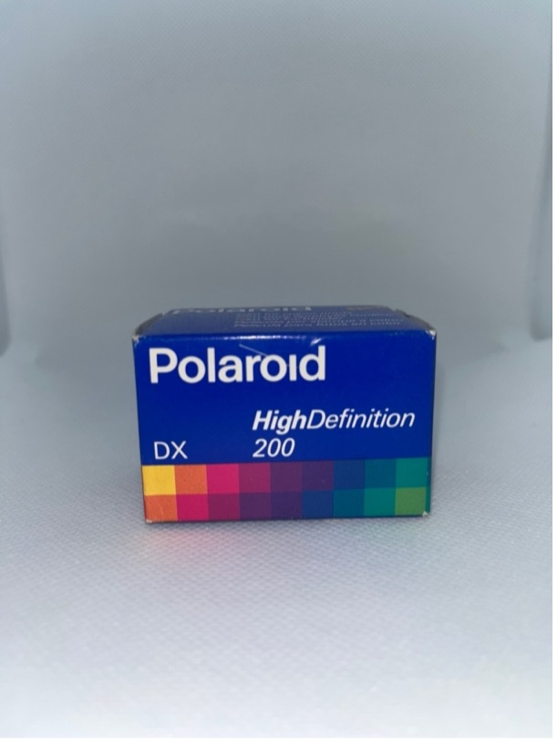

+++
title = '8. Kinofilmy'
date = 2024-06-03
draft = false
+++

# Polaroid film Polachrome 35mm

**Datum spotřeby:** 1977
    
**ASA:**    40

**Počet snímků:**   36 

**Barevný/ČB:** barevný   

**Typ filmu:**  Polachrome 35 mm

**Kupní cena:** 310 kč
    
**Poznámka:** Kinofilm pro analogové fotoaparáty. 
Chemie v krabičce k vyvolání je součástí balení. 
K vyvolání je třeba sada s autoprocessorem.

# Polaroid film High Definition 200

**Datum spotřeby:** 04/1992
    
**ASA:**    200

**Počet snímků:**   36 

**Barevný/ČB:** barevný   

**Typ filmu:** 35 mm

**Kupní cena:** 450 kč
    
**Poznámka:**  
