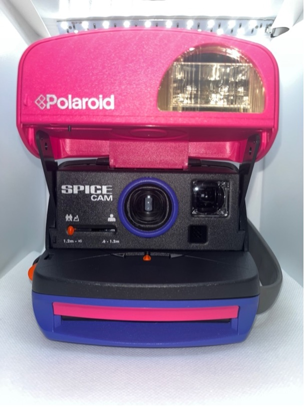

+++
title = '2. 600'
date = 2024-06-03
draft = false
+++

# Polaroid 645 SuperColor

**Rok výroby:**	80.léta
    
**Rozsah zaostření:**	1,2m – nekonečno

**Objektiv:**	116mm f/11
    
**Typ filmu:**	600

**Další funkce:**	blesk, korekce expozice
    
**Stav:**	9/10

**Funkčnost:**	Ano

**Kupní cena:**	500 kč
    
**Poznámka:**	Můj první polaroid.

# Polaroid 636 CloseUp

**Rok výroby:**	1996
    
**Rozsah zaostření:**	0,6m – nekonečno

**Objektiv:**	116mm f/11
    
**Typ filmu:**	600

**Další funkce:**	blesk, korekce expozice, close-up předsádka

**Stav:**	9/10

**Funkčnost:**	?

**Kupní cena:**	500 kč

**Poznámka:**	

# Polaroid 600 OneStep

**Rok výroby:**	1983
    
**Rozsah zaostření:**	0,6m – nekonečno

**Objektiv:**	116mm f/11
    
**Typ filmu:**	600

**Další funkce:**	blesk, korekce expozice, close-up předsádka

**Stav:**	4/10

**Funkčnost:**	?

**Kupní cena:**	220 kč

**Poznámka:** Má upadlé poutko na ruku.

## Limitované edice

# Polaroid 600 Spice Cam

**Rok výroby:**	1997
    
**Rozsah zaostření:**	0,6m – nekonečno

**Objektiv:**	116mm f/11
    
**Typ filmu:**	600

**Další funkce:**	blesk, korekce expozice, close-up předsádka

**Stav:**	4/10

**Funkčnost:**	?

**Kupní cena:**	569 kč

**Poznámka:** Má upadlé poutko na ruku.