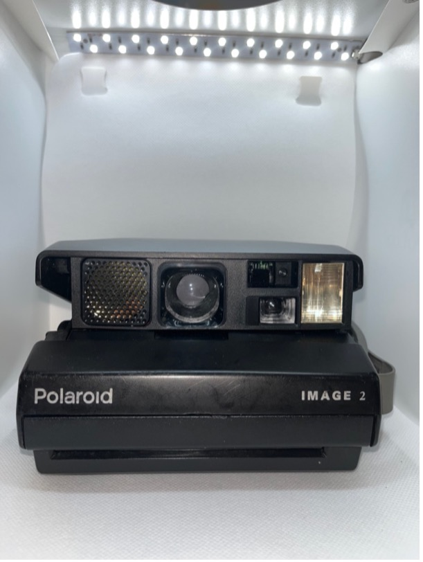

+++
title = '3. Spectra'
date = 2024-06-03
draft = false
+++

# Polaroid Image System

**Rok výroby:**	1986
    
**Rozsah zaostření:**	0,6m – nekonečno

**Objektiv:**	125mm f/10
    
**Typ filmu:**	Spectra

**Další funkce:**	blesk, automatická/manuální expozice, zvukové spouštění, časovač, autofocus
    
**Stav:**	6/10

**Funkčnost:**	?

**Kupní cena:**	300 kč
    
**Poznámka:**	

# Polaroid Image System

**Rok výroby:**	1996
    
**Rozsah zaostření:**	1,2m – nekonečno

**Objektiv:**	125mm f/11
    
**Typ filmu:**	Spectra

**Další funkce:**	blesk, manuální expozice
    
**Stav:**	7/10

**Funkčnost:**	?

**Kupní cena:**	300 kč
    
**Poznámka:**	
