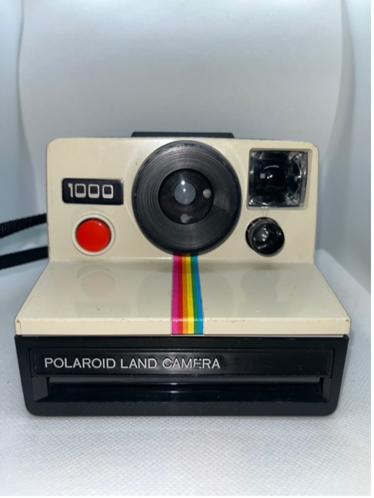

+++
title = '4. SX-70'
date = 2024-06-03
draft = false
description = 'Fotoaparáty SX-70'
+++

# Polaroid Land Camera 1000

**Rok výroby:**	1996
    
**Rozsah zaostření:**	1,2m – nekonečno

**Objektiv:**	103mm f/14,6
    
**Typ filmu:**	SX-70

**Další funkce:**	korekce expozice
    
**Stav:**	7/10

**Funkčnost:**	Ano

**Kupní cena:**	500 kč
    
**Poznámka:**	

# Polaroid Land Camera 1500

**Rok výroby:**	1977
    
**Rozsah zaostření:**	1m – nekonečno

**Objektiv:**	116mm f/9,4
    
**Typ filmu:**	SX-70

**Další funkce:**	korekce expozice
    
**Stav:**	5/10

**Funkčnost:**	Ano

**Kupní cena:**	217 kč
    
**Poznámka:**	